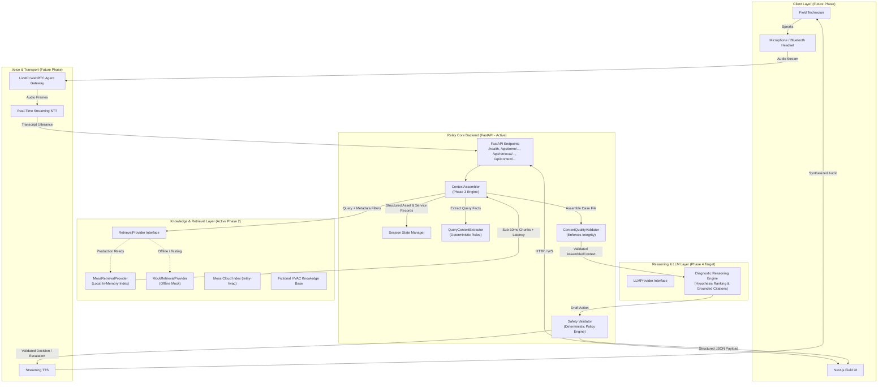
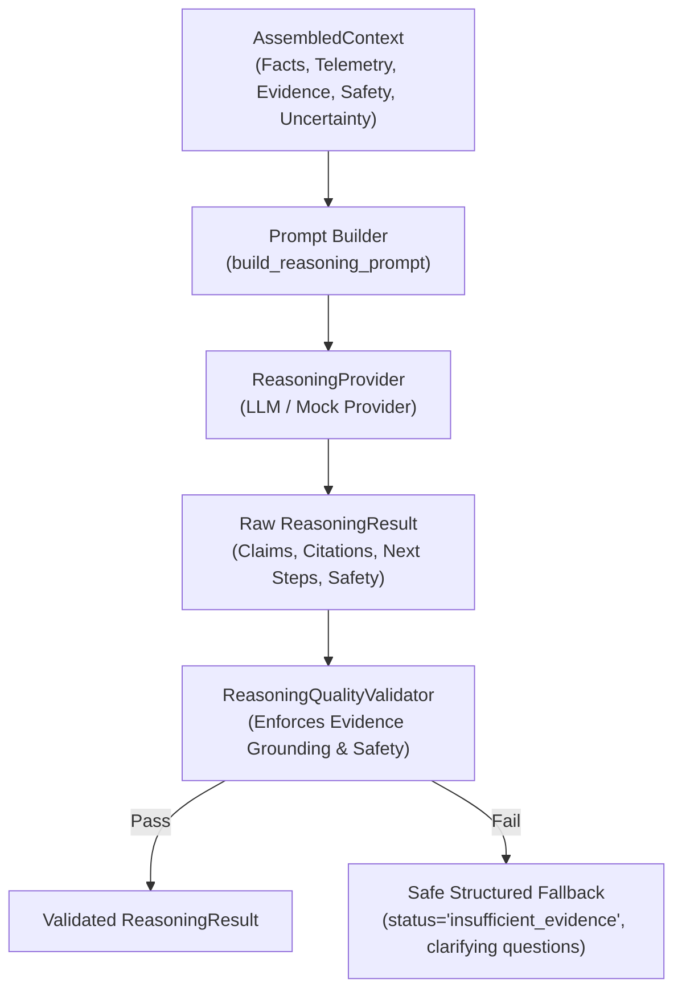
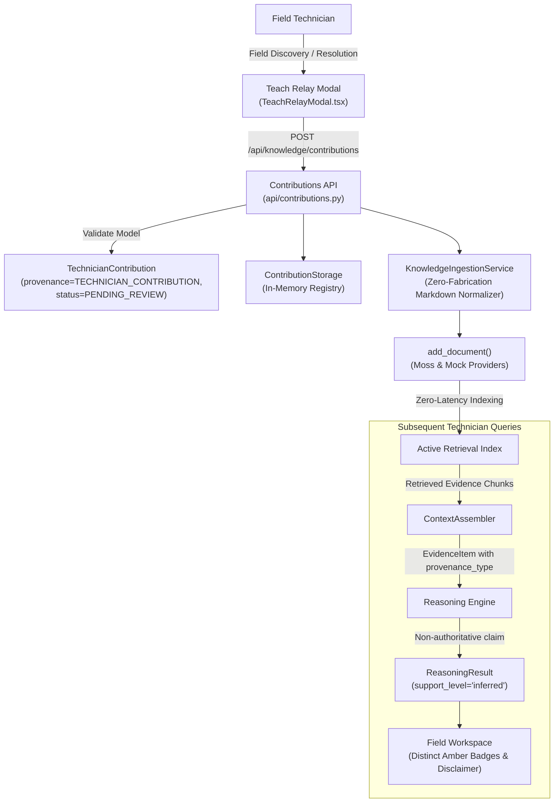
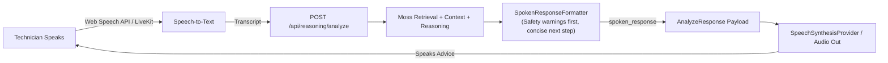

# Technical Architecture: RELAY

**System**: Real-Time AI Decision-Support Copilot for Field Technicians  
**Sprint**: YC Fall 2026 x Moss: The Zero Latency Builder Sprint  
**Document Revision**: 8.0 (Phase 8: Final QA & Demo Readiness)

---

## 1. High-Level Architecture Overview

Relay is architectured as an event-driven, low-latency decision pipeline. The system cleanly separates knowledge retrieval, contextual state assembly, probabilistic LLM reasoning, and deterministic safety enforcement.



---

## 2. Phase 3 Context Assembly Engine

> **CRITICAL INVARIANT**:
> *Phase 3 assembles evidence and context only. It does not generate diagnoses or recommendations.*

### 2.1 The AssembledContext Case File
The `AssembledContext` model (`app/context/assembled_context.py`) unifies:
1. **Query Facts**: Extracted error codes, measurements with units, and equipment references.
2. **Structured Asset Data**: Machine specifications and maintenance logs from `ServiceRecord`.
3. **Classified Evidence**: Chunks from Moss categorized into `service_history`, `maintenance_history`, `troubleshooting`, `technical_manual`, and `safety_procedure`.
4. **Safety Context**: Detected physical hazards (e.g. pressure > 190 PSI), LOTO requirements, and relevant safety SOPs.
5. **Explicit Uncertainty**: Missing information checklist (e.g. missing asset ID, missing pressure reading).
6. **Conflict Detection**: Identification of version disparities across retrieved materials.

### 2.2 Ingestion & Classification Pipeline
```
Technician Utterance: "I'm getting E17 again on unit 017. Pressure is around 195 PSI."
                       │
                       ▼
             QueryContextExtractor
     - error_code: E17
     - measurements: {'pressure_psi': 195.0}
     - asset_reference: "unit 017"
     - is_repeat_issue: True
                       │
                       ▼
             Asset Resolution
     - Candidate: ACX-420-017 (CoolCore ACX-420)
     - Load ServiceRecord: SR-2026-0814-017 (Sensor PT-1 replaced)
                       │
                       ▼
             Moss Retrieval
     - Filtered Query: E17 on ACX-420
     - Retrieved: e17-troubleshooting, unit-017-service-record, pressure-safety-sop
     - Actual Latency: 0.0 - 1.0 ms
                       │
                       ▼
             Deterministic Classification
     - unit-017-service-record  → service_history
     - e17-troubleshooting      → troubleshooting
     - pressure-safety-sop      → safety_procedure
                       │
                       ▼
             Safety Context Assembly
     - high_pressure_hazard: True (195 PSI > 190 PSI threshold)
     - mandatory_loto: True
                       │
                       ▼
             Quality Validation
     - Verified: No diagnosis or recommendation text generated
     - Output: AssembledContext Case File
```

## 3. Phase 4 Evidence-Grounded Reasoning Engine

> **CORE INVARIANT**:
> *Relay performs evidence-grounded reasoning over AssembledContext. It rejects ungrounded claims, respects authoritative safety constraints, and never fabricates citations or diagnoses.*

### 3.1 Reasoning Pipeline Architecture


### 3.2 Structured Output Schema
The `ReasoningResult` model (`app/reasoning/models.py`) provides:
1. **Issue Summary**: Concise statement of what the technician reported.
2. **What We Know**: Structured inventory of directly supported facts from query, telemetry, and service records.
3. **Assessment**: Grounded interpretation of current system state without premature certainty.
4. **Evidence Claims**: Substantive claims tied directly to retrieved document IDs with calibrated `support_level` (`direct`, `inferred`, `insufficient`).
5. **Recommended Next Steps**: Prioritized physical actions citing specific SOP/manual documents, including explicit safety constraints and expected observations.
6. **Decision Branches**: Conditional logic trees (`condition`, `if_true_branch`, `if_false_branch`) grounded in procedural evidence.
7. **Safety Considerations**: Authoritative warnings and Lockout/Tagout mandates inherited from `SafetyContext`.
8. **Clarifying Questions**: Dynamic questions generated from missing context when evidence or query facts are insufficient.
9. **Certainty Level**: Calibrated diagnostic confidence (`supported`, `partially_supported`, `insufficient_evidence`, `conflicting_evidence`).
10. **Citations**: Verifiable references containing real document IDs, source titles, and relevant excerpts.

---

## 4. Phase 5: Next.js Industrial Technician Interface

The Next.js 16 (React 19 + Tailwind CSS v4) frontend delivers an industrial, high-contrast field workspace:
- **Interactive Workspace (`RelayWorkspace.tsx`)**: Coordinates turns, state headers, input composer, and sidebars.
- **Authoritative Safety Panel (`SafetyPanel.tsx`)**: Displays physical hazard warnings and LOTO requirements with zero hallucination.
- **Diagnostic Decision Support Stream (`AssessmentCard.tsx`, `NextStepCard.tsx`, `DecisionBranchPanel.tsx`)**: Renders technical interpretations, prioritized physical actions, and IF/THEN/ELSE conditional branches.
- **Grounding & Technical Evidence (`EvidenceCard.tsx`)**: Provides dual-tab views for claims and verified citations with expandable excerpts.
- **Operational Context Sidebar (`OperationalContextSidebar.tsx`)**: Real-time telemetry provenance (`technician_query` vs `session_telemetry`), asset specs, and retrieved Moss chunks.

---

## 5. Phase 6: Technician Knowledge Contribution & Ingestion ("Teach Relay")

> **CORE ARCHITECTURAL INVARIANT**:
> $$\mathbf{TECHNICIAN\ CONTRIBUTION \neq VERIFIED\ COMPANY\ KNOWLEDGE}$$

### 5.1 Ingestion Architecture


### 5.2 Key Invariants
1. **Provenance Immutability**: All contributions permanently retain `provenance_type="TECHNICIAN_CONTRIBUTION"` and `verification_status="PENDING_REVIEW"`.
2. **Strictly Non-Authoritative**: The reasoning provider treats contributions as contextual clues (`support_level="inferred"`). They can never override official SOP safety thresholds, pressure limits, or LOTO procedures.
3. **Reasoning Validator Enforcement**: `ReasoningQualityValidator` actively rejects any diagnosis or recommendation asserting pending contributions as official company policy.

---

## 6. Phase 7: Real-Time Voice Copilot

> **CORE ARCHITECTURAL INVARIANT**:
> $$\mathbf{THE\ BACKEND\ REASONING\ PIPELINE\ IS\ 100\%\ AUTHORITATIVE}$$
> *Voice is strictly an I/O interaction modality. There is NO separate voice reasoning system or bypassed safety check. All spoken interactions route through the authoritative `POST /api/reasoning/analyze` endpoint.*

### 6.1 Audio Interaction Pipeline


### 6.2 Voice Response Prioritization
Spoken responses are specifically formatted for hands-free audio playback via `SpokenResponseFormatter`:
1. **Critical Safety Warnings First**: High pressure, electrical shock hazards, and mandatory Lockout/Tagout (LOTO) are ALWAYS voiced at the beginning of the audio stream.
2. **Clarifying Questions**: When `status == "needs_information"`, the clarifying question is voiced directly to prompt the technician.
3. **Concise Assessment**: 1–2 brief sentences summarizing the situation without technical jargon or metadata.
4. **Immediate Next Step**: The single most immediate physical action to execute.
5. **Non-Authoritative Attribution**: Explicitly mentions when an assessment stems from unverified technician field observations.
6. **Zero Raw Citations**: File paths, document IDs, JSON tokens, and match scores are excluded from speech.

### 6.3 Voice Provider Layer
- **`WebSpeechRecognitionProvider` & `WebSpeechSynthesisProvider`**: Native browser implementations providing immediate, zero-credential speech recognition and text-to-speech.
- **`LiveKitVoiceBoundary`**: Extensible interface defining room connection, audio frame dispatching, and bidirectional voice bridge for future multi-user WebRTC rooms.

---

## 7. Component Status

| Component | Status | Details |
|---|---|---|
| **Moss Retrieval Engine** | **ACTIVE (Phase 2)** | Sub-10ms in-memory queries with live network and overlay support. |
| **Query Fact Extractor** | **ACTIVE (Phase 3)** | Deterministic extraction of error codes, units, and measurements. |
| **Context Assembler** | **ACTIVE (Phase 3)** | Coordinates facts, structured history, evidence, safety, and uncertainty. |
| **Context Quality Validator** | **ACTIVE (Phase 3)** | Asserts evidence integrity and confirms zero premature diagnosis. |
| **Context Assemble API** | **ACTIVE (Phase 3)** | `POST /api/context/assemble`. |
| **Reasoning Provider Abstraction** | **ACTIVE (Phase 4)** | Decoupled `ReasoningProvider` supporting mock and structured LLM backends. |
| **Reasoning Quality Validator** | **ACTIVE (Phase 4)** | Rejects hallucinated citations, enforces safety constraints, gates output. |
| **Diagnostic Reasoning API** | **ACTIVE (Phase 4)** | `POST /api/reasoning/analyze`. |
| **Next.js Field UI** | **ACTIVE (Phase 5)** | Real-time, responsive dark industrial field-service workspace. |
| **Teach Relay Ingestion** | **ACTIVE (Phase 6)** | Field contribution capture, normalization, live indexing, and provenance tracking. |
| **Real-Time Voice Copilot** | **ACTIVE (Phase 7)** | Hands-free voice loop, SpokenResponseFormatter, Web Speech integration, and LiveKit boundary. |

